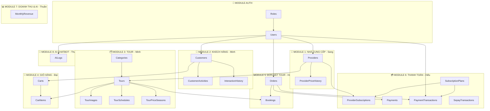
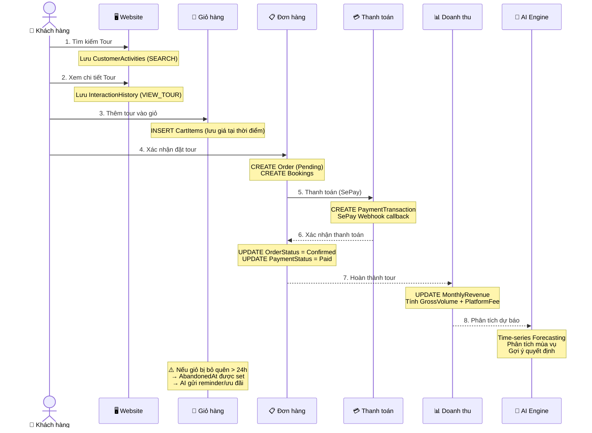

# 🏗️ ERD & Database Design — Da Nang Travel Hub

> **Dự án:** Web Booking Du Lịch tích hợp AI Phân Tích Dữ Liệu  
> **Phạm vi:** Thành Phố Đà Nẵng | Khách sạn + Vé máy bay  
> **DBMS:** SQL Server  
> **Phiên bản:** V5.0 Final

---

## 📊 Sơ đồ ERD (Entity Relationship Diagram)

```mermaid
erDiagram
    Roles ||--o{ Users : "1:N"
    Users ||--o| Providers : "1:1 (PROVIDER role)"
    Users ||--o| Customers : "1:1 (CUSTOMER role)"
    Users ||--o{ Orders : "1:N"
    Users ||--o{ AILogs : "1:N"
    Users ||--o{ PaymentTransactions : "1:N"

    Providers ||--o{ Tours : "1:N"
    Providers ||--o{ ProviderSubscriptions : "1:N"
    Providers ||--o{ ProviderPriceHistory : "1:N"

    SubscriptionPlans ||--o{ ProviderSubscriptions : "1:N"
    SubscriptionPlans ||--o{ PaymentTransactions : "1:N"

    Categories ||--o{ Tours : "1:N"

    Tours ||--o{ TourImages : "1:N"
    Tours ||--o{ Bookings : "1:N"
    Tours ||--o{ TourSchedules : "1:N"
    Tours ||--o{ TourPriceSeasons : "1:N"
    Tours ||--o{ CartItems : "1:N"

    Orders ||--o{ Bookings : "1:N"
    Orders ||--o{ Payments : "1:N"
    Orders ||--o{ PaymentTransactions : "1:N"

    Customers ||--o{ CustomerActivities : "1:N"
    Customers ||--o{ InteractionHistory : "1:N"
    Customers ||--o{ Carts : "1:N"

    Carts ||--o{ CartItems : "1:N"

    Roles {
        INT RoleId PK
        NVARCHAR RoleName UK
    }

    Users {
        INT UserId PK
        NVARCHAR Email UK
        NVARCHAR Username UK
        NVARCHAR PasswordHash
        INT RoleId FK
        NVARCHAR FullName
        NVARCHAR PhoneNumber
        NVARCHAR Address
        DATE DateOfBirth
        NVARCHAR AvatarUrl
        BIT IsActive
        DATETIME CreatedAt
        DATETIME UpdatedAt
    }

    Providers {
        INT ProviderId PK_FK
        NVARCHAR BusinessName
        NVARCHAR BusinessLicense
        NVARCHAR ProviderType
        DECIMAL Rating
        BIT IsVerified
        INT TotalTours
        BIT IsActive
    }

    Customers {
        INT CustomerId PK_FK
        NVARCHAR Address
        DATE DateOfBirth
        NVARCHAR Status
    }

    Categories {
        INT CategoryId PK
        NVARCHAR CategoryName
        NVARCHAR IconUrl
        NVARCHAR Description
    }

    Tours {
        INT TourId PK
        INT ProviderId FK
        INT CategoryId FK
        NVARCHAR TourName
        NVARCHAR ShortDesc
        NVARCHAR Description
        DECIMAL Price
        DECIMAL SeasonalPrice
        INT MaxPeople
        INT CurrentBookings
        NVARCHAR Duration
        NVARCHAR Transport
        NVARCHAR StartLocation
        NVARCHAR Destination
        NVARCHAR ImageUrl
        NVARCHAR Itinerary
        BIT IsActive
        FLOAT PopularityScore
        DATETIME CreatedAt
        DATETIME UpdatedAt
    }

    TourImages {
        INT ImageId PK
        INT TourId FK
        NVARCHAR ImageUrl
        NVARCHAR Caption
        INT SortOrder
    }

    TourSchedules {
        INT ScheduleId PK
        INT TourId FK
        DATE DepartureDate
        DATE ReturnDate
        INT AvailableSlots
        NVARCHAR Status
    }

    TourPriceSeasons {
        INT SeasonId PK
        INT TourId FK
        NVARCHAR SeasonName
        DATE StartDate
        DATE EndDate
        DECIMAL PriceMultiplier
        BIT IsActive
    }

    Carts {
        INT CartId PK
        INT CustomerId FK
        NVARCHAR SessionId
        NVARCHAR Status
        DATETIME CreatedAt
        DATETIME UpdatedAt
        DATETIME AbandonedAt
    }

    CartItems {
        INT CartItemId PK
        INT CartId FK
        INT TourId FK
        DATE TravelDate
        INT Quantity
        DECIMAL UnitPrice
        DECIMAL SubTotal
        DATETIME AddedAt
    }

    Orders {
        INT OrderId PK
        INT CustomerId FK
        DECIMAL TotalAmount
        NVARCHAR OrderStatus
        NVARCHAR PaymentStatus
        NVARCHAR CancelReason
        DECIMAL RefundAmount
        DATETIME OrderDate
        DATETIME UpdatedAt
    }

    Bookings {
        INT BookingId PK
        INT OrderId FK
        INT TourId FK
        DATETIME BookingDate
        INT Quantity
        DECIMAL SubTotal
        NVARCHAR BookingStatus
    }

    Payments {
        INT PaymentId PK
        INT OrderId FK
        NVARCHAR PaymentMethod
        NVARCHAR TransactionId
        DECIMAL Amount
        NVARCHAR PaymentStatus
        DATETIME PaidAt
    }

    MonthlyRevenue {
        INT RevenueId PK
        INT ReportMonth
        INT ReportYear
        INT TotalBookings
        DECIMAL GrossVolume
        DECIMAL PlatformFee
        DECIMAL NetRevenue
        INT CancelledOrders
        DECIMAL CancelRate
        DATETIME CreatedAt
    }

    SubscriptionPlans {
        INT PlanId PK
        NVARCHAR PlanName
        NVARCHAR PlanCode UK
        DECIMAL Price
        INT DurationDays
        NVARCHAR Description
        NVARCHAR Features
        BIT IsActive
    }

    ProviderSubscriptions {
        INT SubId PK
        INT ProviderId FK
        INT PlanId FK
        DATETIME StartDate
        DATETIME EndDate
        NVARCHAR Status
        NVARCHAR PaymentStatus
        DECIMAL Amount
        BIT IsActive
    }

    PaymentTransactions {
        INT TransactionId PK
        INT UserId FK
        INT PlanId FK
        INT OrderId FK
        DECIMAL Amount
        NVARCHAR TransactionCode UK
        NVARCHAR Status
        NVARCHAR PaymentGateway
        NVARCHAR SePayReference
        DATETIME CreatedDate
        DATETIME PaidDate
    }

    SepayTransactions {
        INT Id PK
        NVARCHAR Gateway
        NVARCHAR TransactionDate
        NVARCHAR AccountNumber
        NVARCHAR Code
        NVARCHAR Content
        NVARCHAR TransferType
        DECIMAL TransferAmount
        DECIMAL Accumulated
        NVARCHAR SubAccount
        NVARCHAR ReferenceCode
        NVARCHAR Description
        DATETIME CreatedAt
    }

    CustomerActivities {
        INT Id PK
        INT CustomerId FK
        NVARCHAR ActionType
        NVARCHAR Description
        NVARCHAR Metadata
        DATETIME CreatedAt
    }

    InteractionHistory {
        INT Id PK
        INT CustomerId FK
        NVARCHAR Action
        DATETIME CreatedAt
    }

    ProviderPriceHistory {
        INT PriceId PK
        INT ProviderId FK
        NVARCHAR ServiceType
        NVARCHAR ServiceName
        DECIMAL OldPrice
        DECIMAL NewPrice
        DATETIME ChangeDate
    }

    AILogs {
        INT LogId PK
        INT UserId FK
        NVARCHAR ActionType
        NVARCHAR InputData
        NVARCHAR OutputData
        INT ExecutionTimeMs
        DATETIME CreatedAt
    }
```

---

## 🔗 Quan hệ giữa các bảng (Relationships)



---

## 📋 Mô tả Chi Tiết Từng Bảng Theo Module

### 🔐 Module AUTH (Xác thực)

| Bảng | Mô tả | Phân công |
|------|--------|-----------|
| **Roles** | 3 vai trò: ADMIN, PROVIDER, CUSTOMER | Chung |
| **Users** | Bảng người dùng hệ thống chung. Tất cả roles đều có bản ghi ở đây | Chung |

### 🏢 Module 1: Quản trị Nhà cung cấp (Sang)

| Bảng | Mô tả |
|------|--------|
| **Providers** | Mở rộng từ Users (1:1). Chứa thông tin doanh nghiệp, giấy phép, loại NCC (Hotel/Transport/TourOperator) |
| **ProviderPriceHistory** | 🆕 Lịch sử thay đổi giá dịch vụ — phục vụ **so sánh giá giữa các NCC** |

### 👤 Module 2: Quản lý Khách hàng (Minh)

| Bảng | Mô tả |
|------|--------|
| **Customers** | Mở rộng từ Users (1:1). Chứa thông tin riêng khách hàng: địa chỉ, ngày sinh, trạng thái |
| **CustomerActivities** | Lưu hành vi khách: SEARCH, BOOKING, CANCEL, LOGIN, VIEW_TOUR + metadata JSON |
| **InteractionHistory** | Timeline tương tác của khách (phiên bản đơn giản hơn Activities) |

### 🗂️ Module 3: Quản lý Tour (Minh)

| Bảng | Mô tả |
|------|--------|
| **Categories** | Phân loại tour: Tham quan, Mạo hiểm, Văn hóa, Ẩm thực, Sinh thái, Biển đảo |
| **Tours** | Tour du lịch: tên, mô tả, giá, số chỗ, lịch trình, phương tiện. Có `SeasonalPrice` + `PopularityScore` cho AI |
| **TourImages** | Nhiều hình ảnh cho 1 tour |
| **TourSchedules** | 🆕 Lịch khởi hành cụ thể — tự động đóng/mở tour dựa trên slots |
| **TourPriceSeasons** | 🆕 Điều chỉnh giá theo mùa cao/thấp điểm (hệ số nhân `PriceMultiplier`) |

### 🛒 Module 4: Giỏ hàng & Đặt tour (Đại)

| Bảng | Mô tả |
|------|--------|
| **Carts** | 🆕 Giỏ hàng persistent (thay vì chỉ session). Có `AbandonedAt` để track abandoned bookings |
| **CartItems** | 🆕 Từng item trong giỏ: tour nào, ngày đi, số lượng, giá tại thời điểm thêm |

### 📋 Module 5: Quản lý Đơn đặt tour (Hiếu)

| Bảng | Mô tả |
|------|--------|
| **Orders** | Đơn đặt tour master: trạng thái Pending → Confirmed → Completed / Cancelled. Có `RefundAmount` cho hủy tour |
| **Bookings** | Line items cụ thể trong đơn: tour nào, ngày đi, số lượng, giá |

### 💳 Module 6: Gói dịch vụ & Thanh toán (Hiếu)

| Bảng | Mô tả |
|------|--------|
| **SubscriptionPlans** | Các gói: BASIC (Free), PREMIUM, GOLD — với giá và tính năng |
| **ProviderSubscriptions** | Lịch sử đăng ký gói của NCC: ngày bắt đầu, hết hạn, trạng thái |
| **Payments** | Thanh toán cho đơn đặt tour |
| **PaymentTransactions** | Giao dịch thanh toán tổng quát (cho cả Subscription lẫn Order) |
| **SepayTransactions** | Dữ liệu webhook từ SePay API |

### 📊 Module 7: Dữ liệu & Dự báo AI (Thuần)

| Bảng | Mô tả |
|------|--------|
| **MonthlyRevenue** | Báo cáo doanh thu theo tháng: tổng bookings, doanh thu gộp, hoa hồng, tỷ lệ hủy. Có thêm `NetRevenue`, `CancelledOrders`, `CancelRate` |

### 🤖 Module 8: Chatbot AI (Thuần)

| Bảng | Mô tả |
|------|--------|
| **AILogs** | Lưu log mọi tương tác AI: Chatbot requests, Forecast engine, thời gian xử lý |

---

## 📐 Quy trình nghiệp vụ (Business Flow)



---

## 🔑 Quy ước đặt tên & Constraints

| Quy ước | Ví dụ |
|---------|-------|
| **Primary Key** | `<TableName>Id` — `TourId`, `OrderId` |
| **Foreign Key** | `FK_<Child>_<Parent>` — `FK_Tours_Providers` |
| **Index** | `IDX_<Table>_<Column>` — `IDX_Tour_Provider` |
| **Status values** | PascalCase: `Pending`, `Confirmed`, `Completed`, `Cancelled` |
| **Timestamps** | `CreatedAt`, `UpdatedAt`, `PaidAt` |

---

## 🆕 Các bảng MỚI so với schema hiện tại (V4.0)

> [!IMPORTANT]
> **4 bảng mới** được thêm để đáp ứng đầy đủ yêu cầu Module trong bài tập lớn:

| Bảng mới | Module | Mục đích |
|----------|--------|----------|
| **`TourSchedules`** | Module 3 (Minh) | Quản lý lịch khởi hành cụ thể, tự động đóng/mở tour |
| **`TourPriceSeasons`** | Module 3 (Minh) | Điều chỉnh giá linh hoạt theo mùa cao/thấp điểm |
| **`Carts`** + **`CartItems`** | Module 4 (Đại) | Giỏ hàng persistent + tracking abandoned bookings |
| **`ProviderPriceHistory`** | Module 1 (Sang) | So sánh giá giữa các NCC theo thời gian |

> [!NOTE]
> Các cột mới trong bảng cũ:
> - `Tours.SeasonalPrice` — Giá theo mùa (tính toán từ TourPriceSeasons)
> - `Tours.CurrentBookings` — Số booking hiện tại (đếm tự động)
> - `Tours.PopularityScore` — Điểm phổ biến cho AI gợi ý
> - `Orders.RefundAmount` — Số tiền hoàn trả khi hủy tour
> - `MonthlyRevenue.NetRevenue` — Doanh thu ròng
> - `MonthlyRevenue.CancelledOrders` + `CancelRate` — Dữ liệu cho AI phân tích
